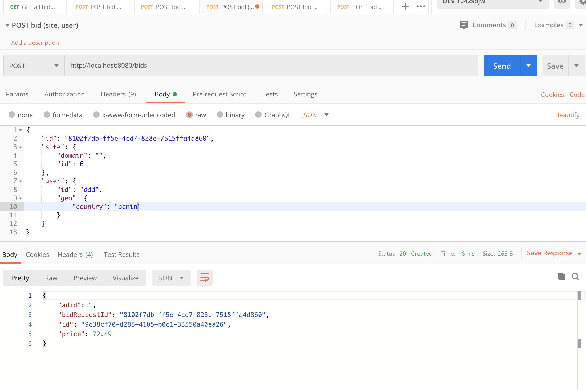

# Simple RTB agent #

Solution for rtb agent with Akka Http, actors and some simple matching by multiple criteria.

### How do I get set up project and run it? ###

* I have used JetBrains IDE with scala plugin so suggest use the same IDE for set up project and running it.
* In JetBrains IDE import stb project. Wait until all dependencies will be installed and project will be imported.
* Entry point of application is `Application.scala`. Open this file in IDE and run it.
* Go to `http://localhost:8080/bids`. If you see an empty list of bids you have successfully started HTTP server.

### How to test it ###

You can use exported collection of requests that can be imported into postman :) Exported collections are placed as SimpleRtb.postman_collection.json at root.



### How to generate more campaigns ###

You can use `Generate.scala` for generating more campaigns. Just apply changes in `Generator.scala` and run generator and do copy paste from terminal to campaigns.json file that you can found in resources folder.

```scala
def main(args: Array[String]): Unit = {
    val campaigns: Set[Campaign] = CampaignsGenerator(Some(100), Some(10), Some(1000))
    println(campaigns.toJson.prettyPrint)
}
```

### My insights ###

* Solution is not good enough. Matching logic is not complete and error prone. Probably the matching algorithm with 
scores should be used that could let to get campaigns with match scores and return campaign that have best score. 
I'm not good enough to implement such matching in short period of the time. 
* Current solution could be also improved by using Akka streams or flows and maybe it would be possible somehow to make parallel matching.
With Java streams it is quite easy, but with Akka I'm not familiar quite well, so it is not possible to do right now :)
* It would be reasonable to import generated campaigns in some search engine like elasticsearch, do the indexing, create 
correct queries by bid request and get result with scores from elastic search without reimplementing wheel.
* Tests doesn't cover all possible cases.
* Code is not fully written in scala idiomatic way. There are space to improve.
* Code is not extendable and not reusable enough.